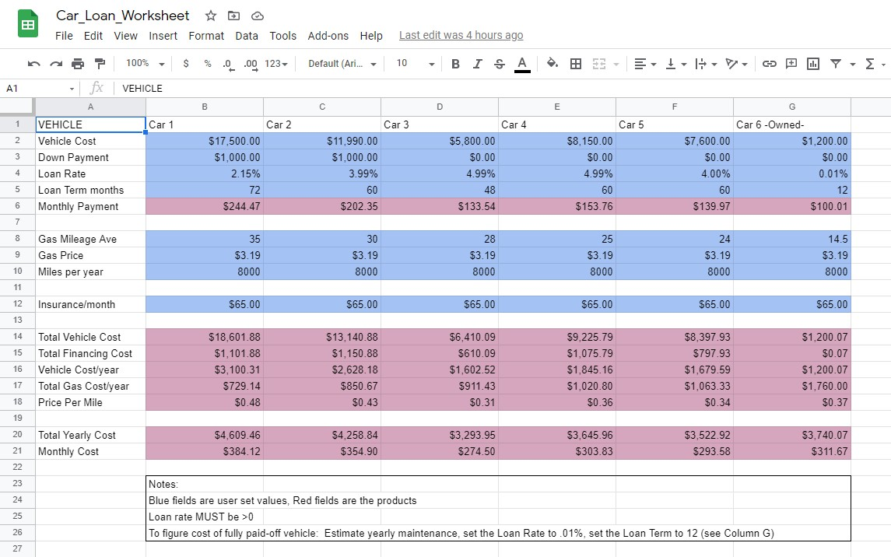

# bug-free-octo-happiness
<b>Personal Projects</b>

This repository contains personal projects, such as:  

[Car Loan Worksheet](/Car_Loan_Worksheet.xlsx)  
  
A linked spreadsheet that computes the total cost of up to six vehicles, taking purchase price, down payment, loan rate and term, gas mileage and price per gallon, yearly miles driven, and monthly insurance premium.  Results are presented both by year and by month.  

[RPi Stomp Box](/RPI-projects/Stomp-Box.md)  
  
Build progression of a Raspberry Pi Zero powered guitar multi-effect pedal, running Guitarix through a custom designed Raspberry Pi hat.  <b>Work In Progress</b>  

More to come!
